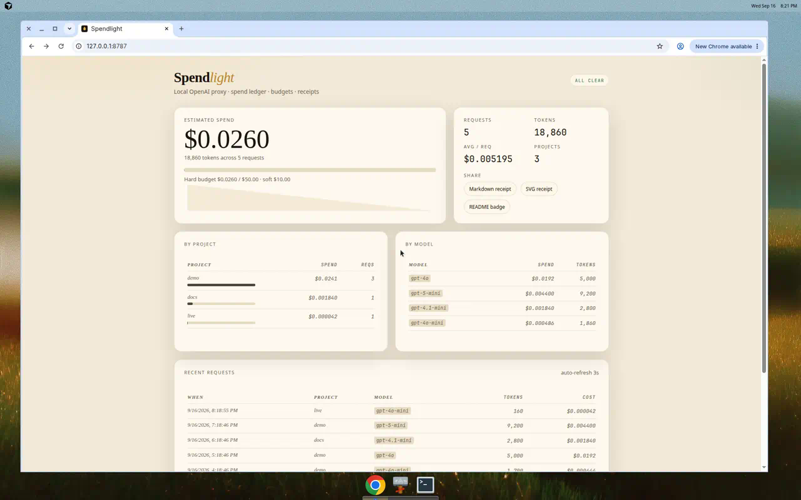
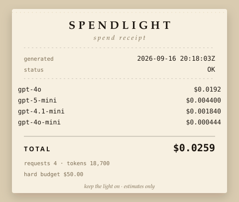

# Spendlight

Drop-in **OpenAI-compatible** reverse proxy for your laptop. Point any client at Spendlight instead of the provider, keep (or omit) your API key, and get a local spend ledger, soft/hard budgets, and shareable receipts.

Swap the base URL. That is the whole integration.

> **v1 is cost, budgets, and receipts only.** It is not a gateway, a tracer, or a billing system.



## What it is

A single Node process that:

1. Speaks the OpenAI Chat Completions API at `/v1/chat/completions` (other `/v1/*` paths pass through).
2. Forwards to any OpenAI-compatible upstream (`OPENAI_BASE_URL` + `OPENAI_API_KEY`).
3. Writes a spend ledger (model, tokens, estimated USD, project tag, timestamp, request id).
4. Warns on a **soft** budget and rejects further mutating `/v1` calls with **402** when a **hard** budget is hit.
5. Serves a one-page dashboard, Markdown + SVG receipts, and a README badge.

## What it isn’t (v1 non-goals)

- Tracing, evals, or an observability suite
- Multi-provider routing, load balancing, or failover
- Auth on the dashboard — this is a **local** tool; bind to localhost
- Perfect, billing-grade invoices — costs are **estimates** from a local price table
- A public or shared-team proxy — do not put it on the internet

## Architecture

```
  OpenAI SDK / curl / app
           |
           |  baseURL = http://127.0.0.1:8787/v1
           v
  ┌──────────────────────────────────────────┐
  │              Spendlight                  │
  │  /                 local dashboard       │
  │  /receipt.md .svg  shareable receipts    │
  │  /badge.svg        README badge          │
  │  /v1/*             reverse proxy         │
  │        │                                 │
  │        ├─ budget check (SQLite sums)     │
  │        │    soft → warning header        │
  │        │    hard → 402 on mutating /v1   │
  │        ├─ upstream fetch                 │
  │        └─ ledger insert (tokens × price) │
  └──────────────────────────────────────────┘
           |                      |
           v                      v
   OpenAI-compatible API     SQLite (WAL)
   OPENAI_BASE_URL           SPENDLIGHT_DB
```

Pricing is a local table (sane OpenAI defaults, overridable in `spendlight.config.json`). Unknown models use a conservative fallback price. Costs are **estimates**, not provider invoices.

Tag traffic with `x-spendlight-project` (or `x-spendlight-tag`, `?project=`, or `spendlight_project` in the JSON body). That is the budget bucket. Tags are labels, not authentication.

## Install

Needs **Node 22.13+** (built-in `node:sqlite`). Pick one path.

### npx

```bash
export OPENAI_API_KEY=sk-...
npx --yes github:realvaleh/Spendlight
```

Then open [http://127.0.0.1:8787](http://127.0.0.1:8787).

### Docker Compose / `docker run`

```bash
export OPENAI_API_KEY=sk-...
docker compose up --build
```

Compose publishes **localhost only** (`127.0.0.1:8787`). Inside the container Spendlight still listens on `0.0.0.0` so the published port works.

```bash
docker build -t spendlight . && docker run --rm -p 127.0.0.1:8787:8787 \
  -e OPENAI_API_KEY \
  -e SPENDLIGHT_HARD_BUDGET_USD=25 \
  -v spendlight-data:/data spendlight
```

### Clone + npm

```bash
git clone https://github.com/realvaleh/Spendlight.git
cd Spendlight
cp .env.example .env          # set OPENAI_API_KEY
cp spendlight.config.example.json spendlight.config.json
npm install
npm start                     # http://127.0.0.1:8787
```

CLI flags: `spendlight --config ./spendlight.config.json --port 8787`

## Quickstart

Once Spendlight is running, point a client at it and send one completion. The proxy injects `OPENAI_API_KEY` when the client omits `Authorization`.

```bash
export OPENAI_BASE_URL=http://127.0.0.1:8787/v1
# keep OPENAI_API_KEY as-is, or let Spendlight inject it

curl http://127.0.0.1:8787/v1/chat/completions \
  -H "content-type: application/json" \
  -H "x-spendlight-project: demo" \
  -d '{"model":"gpt-4o-mini","messages":[{"role":"user","content":"hi"}]}'
```

Open [http://127.0.0.1:8787](http://127.0.0.1:8787). You should see the `demo` request on the dashboard, a non-zero estimated spend, and links to receipts.

SDK-shaped equivalent:

```js
import OpenAI from "openai";

const openai = new OpenAI({
  baseURL: "http://127.0.0.1:8787/v1",
  apiKey: process.env.OPENAI_API_KEY, // or any placeholder if Spendlight holds the real key
  defaultHeaders: { "x-spendlight-project": "demo" },
});

await openai.chat.completions.create({
  model: "gpt-4o-mini",
  messages: [{ role: "user", content: "hi" }],
});
```

## Budgets

**Soft** = warn and still forward (`x-spendlight-budget-status: soft` plus `x-spendlight-budget-warning`).  
**Hard** = kill-switch: mutating `/v1` requests return **402** and never hit upstream. `GET /v1/models` still works.

Env vars set the **global** budget (overrides `budgets.global` in the config file):

```bash
export SPENDLIGHT_SOFT_BUDGET_USD=10
export SPENDLIGHT_HARD_BUDGET_USD=25
```

Per-project limits live in `spendlight.config.json`. A request is blocked if **either** the project hard cap **or** the global hard cap is hit.

```json
{
  "budgets": {
    "global": { "softUsd": 10, "hardUsd": 25 },
    "projects": {
      "demo": { "softUsd": 1, "hardUsd": 2 }
    }
  }
}
```

Tag the bucket on every call:

```bash
# header (preferred)
curl http://127.0.0.1:8787/v1/chat/completions \
  -H "content-type: application/json" \
  -H "x-spendlight-project: demo" \
  -d '{"model":"gpt-4o-mini","messages":[{"role":"user","content":"hi"}]}'

# or query string
curl "http://127.0.0.1:8787/v1/chat/completions?project=demo" ...

# or JSON body (stripped before forwarding)
curl ... -d '{"model":"gpt-4o-mini","spendlight_project":"demo","messages":[...]}'
```

Hard-limit responses look like OpenAI errors:

```json
{
  "error": {
    "message": "Spendlight hard budget exceeded (global 'global'): $0.045 / $0.040. Kill-switch is on; further completions are rejected.",
    "type": "spendlight_budget_exceeded",
    "code": "budget_hard_limit"
  }
}
```

HTTP status is **402**. Clients choose the project tag; a global hard cap is the only limit that cannot be tagged around.

## Receipts

| URL | What |
| --- | --- |
| `/` | Dashboard (spend, budgets, recent requests) |
| `/receipt.md` | Markdown receipt |
| `/receipt.svg` | Paper-style SVG receipt |
| `/badge.svg` | Shields-style badge for a local README |
| `/api/summary` | JSON for the same numbers |
| `/health` | Liveness |

Sample receipt (checked in):



```bash
curl -s http://127.0.0.1:8787/receipt.md
curl -s http://127.0.0.1:8787/receipt.svg -o receipt.svg
curl -s http://127.0.0.1:8787/badge.svg -o badge.svg
```

Local README badge (only useful on a machine that can reach the proxy):

```md

```

Streaming chat completions: Spendlight sets `stream_options.include_usage` so the final SSE chunk can be logged.

## Security (local proxy)

Spendlight is a **localhost reverse proxy that can spend your API key**. Treat the bind address like a secret.

- **Bind localhost.** Default `SPENDLIGHT_HOST=127.0.0.1`. Docker Compose publishes `127.0.0.1:8787`. Do not put this on `0.0.0.0` / the public internet. The dashboard, receipts, badge, and `/api/summary` have **no auth**.
- **API keys.** If `OPENAI_API_KEY` is set, any client that can reach the proxy and omits `Authorization` uses your key. If the client sends `Authorization`, that value is forwarded instead. Keys are not written to the ledger or stdout. Prefer the env var over `upstream.apiKey` in JSON (do not commit keys).
- **Trust model.** Anyone who can talk to the port is trusted: they can complete, retag projects, and read spend. Project tags are labels, not ACLs. CORS is allowed only from `http(s)://127.0.0.1`, `localhost`, and `::1` so a random website cannot drive the proxy from the browser.
- **Upstream URL.** `OPENAI_BASE_URL` is operator-controlled (http/https only). Clients cannot pick a different host. Do not point it at arbitrary internal URLs.
- **Runtime deps.** Zero npm runtime dependencies (`node:http`, `fetch`, `node:sqlite`).

## Env vars

| Variable | Default | Purpose |
| --- | --- | --- |
| `OPENAI_API_KEY` | — | Upstream key if the client does not send `Authorization` |
| `OPENAI_BASE_URL` | `https://api.openai.com/v1` | Upstream OpenAI-compatible base |
| `SPENDLIGHT_HOST` | `127.0.0.1` | Bind address (`0.0.0.0` inside Docker) |
| `SPENDLIGHT_PORT` | `8787` | Listen port |
| `SPENDLIGHT_DB` | `./data/spendlight.db` | SQLite path (`/data/spendlight.db` in Docker) |
| `SPENDLIGHT_CONFIG` | `./spendlight.config.json` | Optional JSON config |
| `SPENDLIGHT_SOFT_BUDGET_USD` | — | Global soft budget (warn) |
| `SPENDLIGHT_HARD_BUDGET_USD` | — | Global hard budget (kill-switch) |

## Smoke test

Proves logging + kill-switch against a **mock** upstream (no paid call):

```bash
npm test
```

## Stack

TypeScript + Node 22 (`node:http`, `fetch`, `node:sqlite`). Zero runtime npm dependencies.

## License

[MIT](LICENSE) © 2026 Valeh
